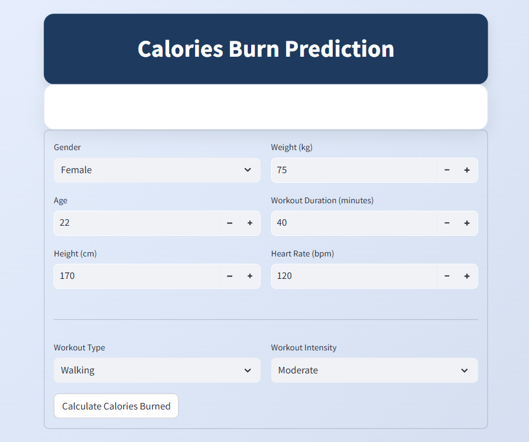
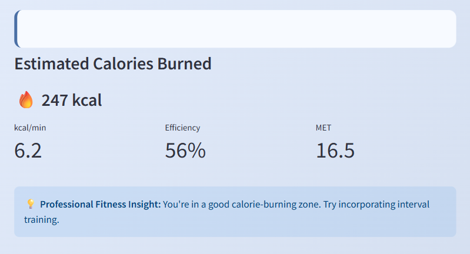

# 🔥 Calories Burn Predictor App

🎯 **Objective**
Predict the number of calories burned during a workout session based on personal and workout data using **Linear Regression** 🧠.


## 🖥️ App Overview

This Streamlit app allows users to input personal and exercise-related data to predict how many **calories** they burn. The UI is elegantly styled and includes smart insights for fitness tracking.

## 📊 Features

* 🧑‍🤝‍🧑 **User Inputs**: Gender, Age, Height, Weight
* ⏱️ **Workout Details**: Duration, Heart Rate, Workout Type & Intensity
* 🔍 **Prediction Output**:

  * Total Calories Burned
  * kcal/min
  * Efficiency %
  * MET (Metabolic Equivalent of Task)
* 💡 **Fitness Tips** based on your result
* 💻 Built with **Streamlit** and styled using **custom CSS**
* 📦 Load and use a trained Linear Regression model (`model.pkl`) for predictions


## 🧪 Machine Learning Model

 **Linear Regression** model trained to estimate calories burned with excellent accuracy.
**Model Performance Metrics:**

| Metric      | Value  |
| ----------- | ------ |
| Average R²  | 0.9666 |
| Average MAE | 8.34   |
| Average MSE | 127.22 |

## 🖼️ UI Preview

| Input Form (User Data)        | Prediction Output (Calories Burned)         |
| ----------------------------- | ------------------------------------------- |
|  |  |


## 🚀 How to Run the App

1. ✅ Make sure you have Python 3.x installed
2. 📦 Install dependencies:

```bash
pip install streamlit pandas scikit-learn
```

3. ▶️ Run the app:

```bash
streamlit run app.py
```
